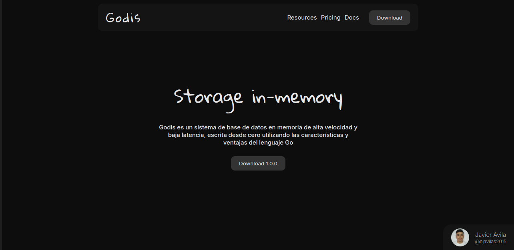

# Godis

**Godis** es una implementación ligera de Redis escrita en Go, intenta ser un proyecto educativo y funcional en entornos de producion

## Contacto
Si tienes alguna pregunta o necesitas soporte, no dudes en contactarme:

Nombre: Javier Avila
Email: [njavilas2015@gmail.com]
GitHub: njavilas2015

## Apóyame con un café ☕️

Si te gusta mi trabajo y quieres apoyarme, ¡puedes invitarme a un café! 😊

